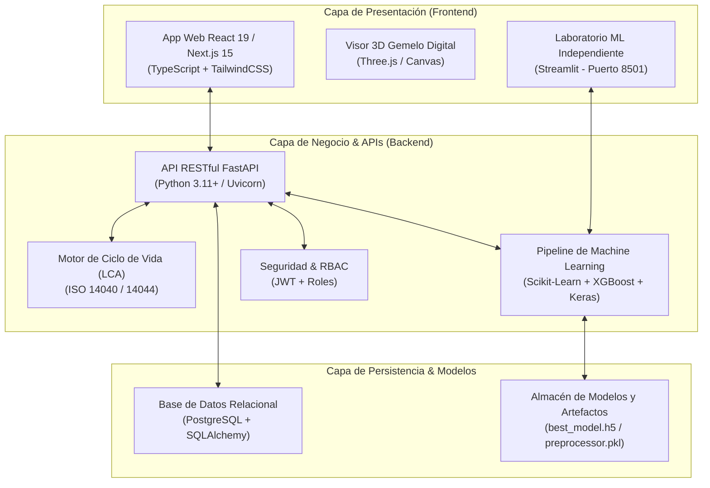

# 🌾 Guía Integral del Sistema: Análisis de Coste de Carbono de Gemelos Digitales (AP-9)
## Documento Maestro de Arquitectura, Módulos Funcionales y Guión de Exposición

---

## 📌 1. Visión General del Proyecto

### 1.1. ¿Qué es el Sistema AP-9?
El **Sistema AP-9** es una plataforma integral de ingeniería de software, analítica ambiental e Inteligencia Artificial diseñada para **cuantificar, auditar, predecir y optimizar la huella de carbono** asociada al despliegue y operación de **Gemelos Digitales (Digital Twins - DT)** en el sector agrícola e industrial.

### 1.2. El Problema que Resuelve (La "Paradoja de la Digitalización")
Existe la creencia común de que digitalizar una operación agrícola o industrial es inherentemente "verde" o de impacto cero. Sin embargo:
1. **Consumo de Hardware IoT & Edge:** Cientos o miles de sensores en campo transmiten continuamente datos telemétricos, requiriendo nodos pasarela (*gateways*) y dispositivos Edge que consumen energía eléctrica de forma ininterrumpida.
2. **Cómputo en la Nube e Inferencia:** Procesar modelos tridimensionales (3D), renderizar gemelos en tiempo real y correr simulaciones matemáticas en servidores *Cloud* genera un gasto energético severo. Dependiendo de la matriz energética regional (intensidad de carbono de la red eléctrica en $\text{kg CO}_2\text{e/kWh}$), esto produce toneladas de emisiones indirectas (Alcance 2 de GHG Protocol).
3. **Falta de Trazabilidad y Estándares:** Los agricultores y gestores de sostenibilidad carecen de herramientas unificadas bajo normas internacionales (**ISO 14040 / ISO 14044 / GHG Protocol**) para auditar si el gemelo digital ahorra más carbono del que emite.

### 1.3. La Propuesta de Valor
El sistema AP-9 unifica en una única arquitectura:
- **Gestión agronómica y técnica de parcelas y gemelos digitales 3D.**
- **Motor de cálculo de Análisis de Ciclo de Vida (LCA)** con factores de emisión certificados (IPCC / DEFRA / IEA).
- **Simulación y comparación de escenarios ecológicos** (ej. migración a energía solar, optimización de frecuencias de telemetría).
- **Asistente Inteligente de Carbono basado en LLMs.**
- **Módulo avanzado de Machine Learning y Laboratorio Experimental independiente en Streamlit** con 5 modelos, validación estadística no paramétrica y exportación en formato nativo `.h5`.

---

## 🏛️ 2. Arquitectura Tecnológica del Sistema

---

## 🧩 3. Desglose Exhaustivo Módulo por Módulo (Listo para Exposición)

A continuación se detalla cada uno de los módulos de la aplicación, su propósito de negocio, sus componentes técnicos y cómo explicarlo en una presentación.

---

### Módulo 1: Dashboard Principal (`dashboard`)
- **Propósito:** Ofrecer un centro de mando ejecutivo con indicadores clave de rendimiento (KPIs) en tiempo real sobre el estado agronómico, consumo energético y huella de carbono consolidada.
- **Componentes Visuales:**
  - *KPI Cards:* Emisiones totales ($\text{kg CO}_2\text{e}$), energía consumida ($\text{kWh}$), agua utilizada ($m^3$) y número de gemelos activos.
  - *Gráficos Temporales:* Curvas de emisiones mensuales y acumuladas frente a metas de descarbonización.
  - *Desglose por Alcance (Scopes 1, 2 y 3):* Distribución de emisiones directas (maquinaria/fertilizantes), indirectas eléctricas (red cloud/edge) y asociadas al ciclo de vida.
- **Guión para Exponer:**
  > *"Al iniciar sesión, el usuario se encuentra con el Dashboard Principal. Este panel condensa millones de datos telemétricos en métricas ejecutivas. Permite a los directores de sostenibilidad identificar al instante si la operación está dentro de las metas climáticas y qué componente de la infraestructura genera el mayor impacto."*

---

### Módulo 2: Proyectos Agrícolas (`projects`)
- **Propósito:** Gestión multi-parcela y administración jerárquica de proyectos (ej. Finca Maíz Norte, Invernadero de Tomates, Cultivos de Trigo).
- **Componentes Visuales:**
  - Tarjetas de proyectos con metadata: tipo de cultivo, área en hectáreas, ubicación geográfica y presupuesto de carbono asignado.
  - Modal para crear, editar o archivar proyectos agrícolas con validación de datos.
- **Guión para Exponer:**
  > *"El sistema es multitenant y multi-proyecto. Cada parcela agrícola cuenta con su propia configuración de cultivo, factores de suelo y límites de emisiones permitidas, lo que permite auditar unidades de producción de manera individualizada o agregada."*

---

### Módulo 3: Infraestructura IoT — Sensores en Campo (`sensors`)
- **Propósito:** Inventario, telemetría y auditoría del hardware de medición desplegado en las parcelas.
- **Componentes Visuales:**
  - Registro de sensores de humedad de suelo, radiación solar, estaciones meteorológicas, caudalímetros y sensores NPK.
  - Estado de conectividad (Activo, Mantenimiento, Fuera de Línea).
  - Parámetros de telemetría: frecuencia de muestreo ($\text{Hz}$), protocolo (LoRaWAN, Zigbee, MQTT) y consumo de batería/energía.
- **Guión para Exponer:**
  > *"En este módulo gestionamos la capa física de captura de datos. Cada sensor no solo aporta valor agronómico, sino que su frecuencia de transmisión tiene un coste de carbono asociado debido al procesamiento y almacenamiento que requiere en los servidores."*

---

### Módulo 4: Infraestructura Edge Computing (`edge`)
- **Propósito:** Monitorear los nodos pasarela (*gateways*) y dispositivos de computación en el borde (Raspberry Pi, NVIDIA Jetson, gateways industriales).
- **Componentes Visuales:**
  - Inventario de servidores y gateways locales distribuidos en campo.
  - Cálculo de consumo eléctrico en kWh por nodo y su factor de mitigación por uso de fuentes de energía renovable (solar/baterías locales).
- **Guión para Exponer:**
  > *"El procesamiento en el borde (Edge Computing) reduce el ancho de banda transmitido a la nube, pero introduce consumo local. En este módulo cuantificamos el balance energético de estos dispositivos antes de enviar la información consolidada al gemelo digital."*

---

### Módulo 5: Recursos Cloud & Bases de Datos (`cloud`)
- **Propósito:** Auditar el coste ambiental del almacenamiento masivo, clústeres de cómputo y servidores backend.
- **Componentes Visuales:**
  - Selector de región cloud (ej. AWS us-east, GCP europe-west, Azure) con su respectiva intensidad de carbono en la red ($\text{kg CO}_2\text{e/kWh}$).
  - Estimación de emisiones por almacenamiento de datos históricos y consultas SQL.
- **Guión para Exponer:**
  > *"No todas las nubes contaminan por igual. Un centro de datos ubicado en una región con matrices energéticas basadas en carbón puede emitir hasta 10 veces más que uno alimentado por energía hidroeléctrica o eólica. Este módulo permite simular y elegir la región cloud más limpia."*

---

### Módulo 6: Gemelos Digitales 3D (`digital-twins`)
- **Propósito:** Representación visual interactiva y virtual de las parcelas agrícolas mediante renderizado tridimensional.
- **Componentes Visuales:**
  - Canvas 3D interactivo impulsado por **Three.js**, con rotación orbital, zoom y capas de calor (*heatmaps*).
  - Estado en tiempo real del gemelo digital reflejando datos de los sensores sincronizados.
  - Métrica de resolución del modelo 3D (polígonos y tasa de refresco) y su correlación con la huella computacional.
- **Guión para Exponer:**
  > *"Aquí vemos el núcleo del concepto: el Gemelo Digital. Esta réplica 3D refleja el estado agronómico del cultivo en tiempo real. Sin embargo, mantener un gemelo digital con alta frecuencia de refresco demanda energía de cómputo; el sistema cuantifica con exactitud ese equilibrio."*

---

### Módulo 7: Análisis de Ciclo de Vida — LCA (`lifecycle`)
- **Propósito:** Desglosar el impacto ambiental según la metodología internacional normalizada por **ISO 14040 e ISO 14044**.
- **Componentes Visuales:**
  - Fases del ciclo de vida:
    1. *Adquisición y Fabricación de Hardware (Cradle-to-Gate).*
    2. *Despliegue e Instalación en Campo.*
    3. *Fase Operativa (Uso y Telemetría).*
    4. *Fin de Vida y Disposición (E-waste).*
  - Diagrama de flujo Sankey y gráficos de barras apiladas por fase.
- **Guión para Exponer:**
  > *"La sostenibilidad no se limita al consumo diario. Siguiendo las directrices de la ISO 14044, nuestro motor LCA calcula la huella embebida en la fabricación de los equipos y su reciclaje final, asegurando que el análisis sea riguroso y auditable por certificadoras internacionales."*

---

### Módulo 8: Factores de Emisión (`emission-factors`)
- **Propósito:** Mantener y parametrizar la base de datos de coeficientes de emisión oficiales y actualizados.
- **Componentes Visuales:**
  - Tabla de factores: Electricidad por país/región, Diésel agrícola, Fertilizantes nitrogenados, Cómputo en CPU/GPU, Fabricación de silicio.
  - Fuentes oficiales referenciadas: IPCC 2023, UK DEFRA, International Energy Agency (IEA).
- **Guión para Exponer:**
  > *"Para evitar el 'Greenwashing', los cálculos deben sustentarse en factores reconocidos. Este módulo permite auditar y actualizar los factores de emisión con fuentes científicas transparentes."*

---

### Módulo 9: Comparación de Escenarios ("What-If") (`scenarios`)
- **Propósito:** Herramienta de toma de decisiones para proyectar el impacto antes de realizar inversiones de infraestructura.
- **Componentes Visuales:**
  - Comparativa lado a lado entre **Escenario Base (Actual)** vs. **Escenario Propuesto (Optimizado)**.
  - Variables modificables: Reducción de frecuencia de muestreo de 10 Hz a 1 Hz, instalación de paneles solares en gateways edge, cambio a región cloud de baja intensidad.
  - Retorno de inversión ambiental (ROI de Carbono) y ahorro económico en energía.
- **Guión para Exponer:**
  > *"Este módulo responde a la pregunta del agricultor: '¿Qué pasa si instalo paneles solares en los gateways?' o '¿Qué ahorro si reduzco la frecuencia de telemetría por la noche?'. El sistema calcula el ahorro proyectado en toneladas de CO2 y en costes operativos."*

---

### Módulo 10: Generador de Informes Oficiales (`reports`)
- **Propósito:** Generar reportes técnicos y ejecutivos listos para auditorías, certificaciones o juntas directivas.
- **Componentes Visuales:**
  - Exportación instantánea en tres formatos:
    - 📄 **PDF Formal:** Con portadas institucionales, tablas de auditoría y gráficos vectoriales.
    - 📝 **Word (.docx):** Editable para adjuntar a memorias de sostenibilidad corporativa.
    - 📊 **Excel (.xlsx):** Datos crudos con fórmulas y desgloses celda por celda.
- **Guión para Exponer:**
  > *"Los datos deben ser accionables y comunicables. El módulo de reportes compila el informe completo con un solo clic en formatos ejecutivos listos para entregar a entes reguladores o clientes."*

---

### Módulo 11: Asistente IA de Carbono (`ai-advisor`)
- **Propósito:** Proporcionar un consultor bioclimático inteligente basado en Modelos de Lenguaje (LLMs / Google Gemini) para asesorar al operador en lenguaje natural.
- **Componentes Visuales:**
  - Interfaz conversacional tipo chat.
  - Prompts preconfigurados de optimización agronómica y reducción de huella energética.
  - Respuestas contextualizadas con los datos de las parcelas del usuario.
- **Guión para Exponer:**
  > *"El Asistente IA actúa como un asesor experto de sostenibilidad 24/7. El usuario puede preguntarle en español: '¿Cómo puedo reducir un 20% la huella de mi gemelo digital este mes?' y el modelo analiza los datos del proyecto para recomendar acciones operativas concretas."*

---

### Módulo 12: Pipeline ML de 5 Modelos (`ml-models`) y Laboratorio Streamlit
- **Propósito:** Predecir con Machine Learning la huella de carbono de nuevos gemelos digitales a partir de variables operativas y agronómicas.
- **Componentes:** Panel dentro de la app web con métricas clave, además de un enlace directo al **Laboratorio Independiente de Streamlit (`http://localhost:8501`)** para entrenamiento experimental.
- *(Detallado al máximo en el Documento 2).*

---

### Módulo 13 & 14: Gobernanza, RBAC y Auditoría (`users` / `audit-logs`)
- **Propósito:** Seguridad, trazabilidad y control de acceso basado en roles (Role-Based Access Control - RBAC).
- **Roles Soportados:**
  - `Administrador`: Control total del sistema, configuración de bases de datos y usuarios.
  - `Investigador / Analista`: Capacidad de parametrizar modelos, entrenar pipelines de ML y generar escenarios.
  - `Consulta (Solo Lectura)`: Visualización de dashboards y descarga de reportes sin permisos de edición.
- **Audit Logs:** Registro inmutable con fecha, hora, IP, usuario y acción realizada para cumplimiento legal.
- **Guión para Exponer:**
  > *"Para garantizar la integridad científica de los datos, el sistema implementa un estricto control de accesos RBAC y un registro inmutable de auditoría donde cada modificación queda registrada con firma de usuario y marca de tiempo."*

---

## 🎤 4. Estructura y Guión Sugerido para la Exposición (10-15 minutos)

| Tiempo | Diapositiva / Sección | Mensaje Clave |
| :---: | :--- | :--- |
| **0:00 - 2:00** | **Introducción & Problema** | Plantear la paradoja de la digitalización: el software y el hardware IoT también emiten carbono. Presentar el objetivo del Sistema AP-9. |
| **2:00 - 4:30** | **Demostración de la Web Principal** | Mostrar el Dashboard, el visor 3D del Gemelo Digital y cómo se calculan las emisiones de sensores, edge y cloud bajo normas ISO 14040. |
| **4:30 - 6:30** | **Escenarios "What-If" e Informes** | Simular una optimización energética (paneles solares, cambio de región) y mostrar la generación del reporte PDF/Excel. |
| **6:30 - 11:00** | **Inteligencia Artificial y ML Lab (Streamlit)** | Demostrar el laboratorio en el puerto 8501: los 5 modelos (RF, XGB, SVR, Stacking, Blending), las pruebas estadísticas de Friedman/Wilcoxon y la exportación a `.h5`. |
| **11:00 - 13:00** | **Simulación en Tiempo Real** | Usar el simulador del laboratorio para estimar en segundos la huella de una parcela ingresando variables agronómicas. |
| **13:00 - 15:00** | **Conclusiones y Preguntas** | Cerrar con el impacto científico, la robustez del código y abrir espacio a preguntas del jurado. |
