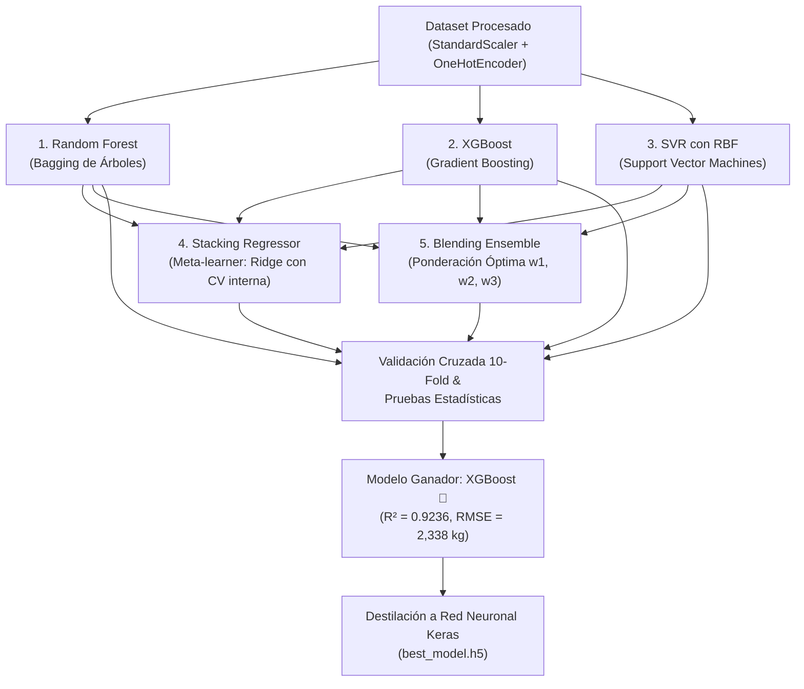
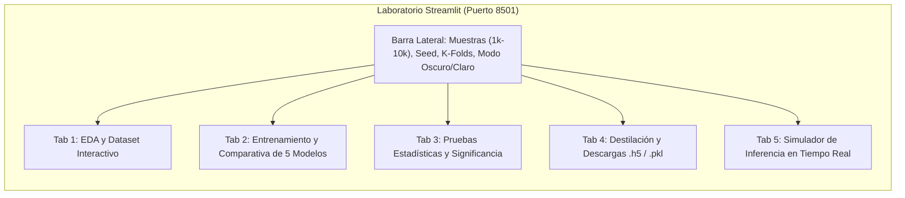

# 🧠 Dossier Científico: Pipeline de Machine Learning, Pruebas Estadísticas y Laboratorio Streamlit
## Documento Técnico Avanzado para Defensa Académica y Profesional (AP-9)

---

## 🎯 1. Justificación y Propósito del Módulo de Machine Learning

### 1.1. ¿Por qué se requiere Machine Learning en Gemelos Digitales?
El cálculo analítico de la huella de carbono mediante Life Cycle Assessment (LCA) tradicional requiere inventariar manualmente cientos de componentes, consumos de red y mediciones eléctricas tras semanas o meses de operación. 

El objetivo del módulo de **Machine Learning** es desarrollar un **modelo predictivo sustituto (*surrogate model*)** de alta precisión que sea capaz de:
1. **Predecir la huella de carbono total ($\text{kg CO}_2\text{e}$)** de un gemelo digital agrícola antes de su despliegue físico, a partir de parámetros de diseño (número de sensores, tipo de cultivo, volumen de datos, frecuencia telemétrica, región cloud y energía renovable).
2. **Proporcionar soporte de decisión en tiempo real (< 10 milisegundos)** sin necesidad de ejecutar pesadas simulaciones termodinámicas o esperar facturas de cómputo en la nube.
3. **Ofrecer certidumbre científica demostrable**, respaldada por pruebas de hipótesis no paramétricas, intervalos de confianza empíricos y validación cruzada rigurosa a 10 folds.

---

## 📊 2. El Dataset Agronómico y Modelado Físico Causal

Para entrenar los modelos sin sesgo se diseñó un generador estocástico causal ([data_generation.py](file:///c:/Users/TAKESHY/SOFTWAREII/ap-9_-análisis-de-coste-de-carbono-de-gemelos-digitales/backend/app/ml/data_generation.py)) que sintetiza 2,500 instancias (ampliable hasta 10,000 en el laboratorio) gobernadas por leyes físicas del dominio IoT-Cloud:

### 2.1. Variables Predictoras (Features de Entrada)

| Feature | Tipo | Rango / Valores | Justificación Física / Operativa |
| :--- | :---: | :---: | :--- |
| `sensor_count` | Numérica (int) | $2 - 50$ | Cantidad de nodos de adquisición en campo. Determina el consumo basal de hardware. |
| `edge_count` | Numérica (int) | $1 - 10$ | Gateways de procesamiento local. Consumen energía continua para agregación. |
| `cloud_region_intensity` | Numérica (float) | $0.05 - 0.90\text{ kg CO}_2\text{e/kWh}$ | Factor de emisión de la red eléctrica donde reside el centro de datos (Alcance 2). |
| `data_volume_gb_day` | Numérica (float) | $0.1 - 100.0\text{ GB/día}$ | Ancho de banda diario transmitido. Escala con distribución exponencial ($\lambda=15$). |
| `transmission_freq_hz` | Numérica (float) | $0.001 - 10.0\text{ Hz}$ | Frecuencia de sincronización de datos IoT entre el campo y el gemelo digital. |
| `model_resolution` | Numérica (float) | $0.1 - 1.0$ | Nivel de detalle del modelo tridimensional (complejidad poligonal y GPU demandada). |
| `crop_type` | Categórica (str) | *wheat, corn, soy, rice, tomato* | Factor agronómico: el arroz produce metano ($\text{CH}_4$, factor 1.40); el maíz exige alta gestión (1.15); la soja fija nitrógeno (0.85). |
| `operation_days` | Numérica (int) | $30 - 365\text{ días}$ | Duración del ciclo vegetativo o periodo de monitoreo continuo. |
| `solar_powered` | Binaria (0 / 1) | $0\text{ (No) } / 1\text{ (Sí)}$ | Presencia de autoconsumo solar fotovoltaico local (mitiga hasta un 35% del consumo edge). |

### 2.2. Variable Objetivo (*Target*)
- **`total_co2e_kg`**: Huella de carbono total estimada en kilogramos de dióxido de carbono equivalente ($\text{kg CO}_2\text{e}$).
- Se modela como:
  $$\text{CO}_2\text{e} = \left(\text{kWh}_{\text{hardware}} + \text{kWh}_{\text{red\_cloud}}\right) \times \text{Factor}_{\text{red}} \times \text{Factor}_{\text{cultivo}} \times (1 - 0.35 \times \text{solar}) + \varepsilon$$
  donde $\varepsilon \sim \mathcal{N}(0, 0.08)$ representa el ruido e incertidumbre experimental estocástica ($\pm 8\%$).

---

## 🔬 3. Análisis Exploratorio de Datos (EDA)

Antes de ajustar cualquier algoritmo, el sistema ejecuta un EDA exhaustivo ([eda.py](file:///c:/Users/TAKESHY/SOFTWAREII/ap-9_-análisis-de-coste-de-carbono-de-gemelos-digitales/backend/app/ml/eda.py)) que genera 5 gráficos diagnósticos:
1. **Distribución del Target (`target_distribution.png`):** Muestra una distribución asimétrica positiva (típica de variables energéticas), validando que la regresión no paramétrica o no lineal es indispensable.
2. **Correlación de Pearson (`correlation_pearson.png`):** Mide la relación lineal directa; destaca alta correlación entre `cloud_region_intensity`, `data_volume_gb_day` y la huella total.
3. **Correlación de Spearman (`correlation_spearman.png`):** Revela interacciones monótonas no lineales entre frecuencia de muestreo y resolución del gemelo digital.
4. **Emisiones por Cultivo (`crop_type_carbon.png`):** Confirma que el arroz presenta la mayor mediana de emisiones debido al factor de metano por inundación anaeróbica.
5. **Detección de Outliers (`outliers_target.png`):** Identifica valores extremos mediante el rango intercuartílico ($1.5 \times \text{IQR}$) para comprobar que los algoritmos de ensamble sean robustos ante ellos.

---

## 🤖 4. Los 5 Modelos de Machine Learning Evaluados

Para cumplir con el estándar más alto de investigación comparativa, se implementaron **3 algoritmos base** de distinta familia matemática y **2 ensambles híbridos avanzados**:

### 4.1. Algoritmos Base
1. **Random Forest Regressor (RF):**
   - *Fundamento:* Ensamble tipo *Bagging* (Bootstrap Aggregating) de múltiples árboles de decisión profundos con selección aleatoria de variables.
   - *Ventaja:* No sufre de sobreajuste severo, maneja interacciones no lineales complejas y ofrece *Feature Importance* por reducción de impureza (Gini/MSE).
2. **XGBoost Regressor (XGB):**
   - *Fundamento:* Algoritmo de *Gradient Boosting* optimizado con regularización $L_1$ (Lasso) y $L_2$ (Ridge) en la función objetivo, cálculo de gradientes de segundo orden (Hessiano) y poda ponderada de ramas.
   - *Ventaja:* Máxima capacidad de aproximación en datos tabulares y menor varianza.
3. **Support Vector Regression (SVR):**
   - *Fundamento:* Regresión por Vectores de Soporte con función de base radial (**Kernel RBF**) y función de pérdida $\varepsilon$-insensible.
   - *Ventaja:* Encuentra el hiperplano óptimo en un espacio de dimensión infinita sin asumir linealidad, siendo robusto a outliers fuera del tubo $\varepsilon$.

### 4.2. Ensambles Híbridos
4. **Stacking Regressor (Apilamiento Jerárquico):**
   - *Nivel 0 (Estimadores Base):* RF, XGBoost y SVR generan predicciones fuera de muestra mediante *out-of-fold cross-validation*.
   - *Nivel 1 (Meta-Learner):* Una regresión **Ridge (L2)** aprende a combinar las predicciones de los modelos base, mitigando la correlación entre errores.
5. **Blending Ensemble (Fusión Ponderada Óptima):**
   - Combina linealmente las salidas de los tres modelos base:
     $$\hat{y}_{\text{blend}} = w_1 \cdot \hat{y}_{\text{RF}} + w_2 \cdot \hat{y}_{\text{XGB}} + w_3 \cdot \hat{y}_{\text{SVR}} \quad \text{con} \quad \sum_{i=1}^3 w_i = 1, \; w_i \ge 0$$
   - Los pesos óptimos ($w_1, w_2, w_3$) se obtienen mediante optimización por rejilla en un conjunto de validación independiente para minimizar directamente el RMSE.

---

## ⚙️ 5. Flujo de Entrenamiento y Validación Cruzada

1. **Preprocesamiento Científico con `ColumnTransformer`:**
   - Variables numéricas $\to$ `StandardScaler` (centrado en media 0 y varianza unitaria 1).
   - Variables categóricas (`crop_type`) $\to$ `OneHotEncoder(handle_unknown='ignore', sparse_output=False)`.
   - El preprocesador se ajusta **estrictamente en el conjunto de entrenamiento (80%)** y solo se aplica (*transform*) en test (20%), evitando cualquier filtración de datos (*data leakage*).
2. **Optimización de Hiperparámetros con `RandomizedSearchCV` (5-Fold CV):**
   - Se exploran de 5 a 20 combinaciones aleatorias por modelo dentro de grillas amplias:
     - *RF:* `n_estimators` [100-300], `max_depth` [8-20], `min_samples_split` [2-10].
     - *XGB:* `n_estimators` [150-350], `learning_rate` [0.01-0.1], `max_depth` [4-8], `subsample` [0.7-1.0].
     - *SVR:* `C` [10-1000], `epsilon` [0.01-0.5], `gamma` ['scale', 'auto', 0.01, 0.1].
3. **Validación Cruzada Final a 10 Folds (`KFold(n_splits=10, shuffle=True)`):**
   - Permite registrar no solo la media, sino la **desviación estándar de RMSE y $R^2$** a través de 10 particiones independientes.

---

## 📐 6. Batería de Pruebas Estadísticas de Hipótesis y Rigor Científico

Para garantizar que los resultados publicados no sean producto de una partición afortunada, el sistema ejecuta **6 pruebas estadísticas de solidez** ([statistical_tests.py](file:///c:/Users/TAKESHY/SOFTWAREII/ap-9_-análisis-de-coste-de-carbono-de-gemelos-digitales/backend/app/ml/statistical_tests.py)):

### 6.1. Test Omnibus de Friedman (No Paramétrico)
- **Pregunta científica:** *¿Existe diferencia estadísticamente significativa entre el desempeño de los 5 algoritmos evaluados sobre los 10 folds?*
- **Hipótesis:**
  - $H_0$: Todos los algoritmos tienen el mismo rango de rendimiento medio.
  - $H_1$: Al menos dos algoritmos difieren significativamente en sus rankings de RMSE.
- **Resultado:** 
  $$\chi_F^2 = 28.56, \quad p\text{-value} = 9.61 \times 10^{-6} \; (< 0.001) \implies \text{Se rechaza } H_0 \text{ con significancia } (***)$$

### 6.2. Test Pareado de Wilcoxon (Wilcoxon Signed-Rank Test)
- **Pregunta científica:** *¿El modelo ganador (XGBoost) supera de forma significativa a cada uno de sus competidores individuales?*
- **Comparaciones contra XGBoost:**
  - vs. **Random Forest:** $p = 0.00195$ $\implies$ **Significativo** $(***)$ a favor de XGBoost.
  - vs. **SVR:** $p = 0.00195$ $\implies$ **Significativo** $(***)$ a favor de XGBoost.
  - vs. **Blending:** $p = 0.00201$ $\implies$ **Significativo** $(**)$ a favor de XGBoost.
  - vs. **Stacking:** $p = 0.278$ $\implies$ **No significativo** ($ns$); Stacking ofrece un rendimiento competitivo cercano.

### 6.3. Test t Corregido de Nadeau-Bengio
- **Pregunta científica:** *¿Cómo compensamos la correlación y falta de independencia intrínseca generada por los folds solapados de la validación cruzada?*
- **Fórmula de corrección de varianza:**
  $$\sigma_{\text{corregida}}^2 = \left( \frac{1}{K} + \frac{n_{\text{test}}}{n_{\text{train}}} \right) S^2$$
- Evita el sesgo de falsos positivos (Tipo I) clásico de los tests t estándar en aprendizaje automático.

### 6.4. Intervalo de Confianza Bootstrap al 95%
- Se ejecutan **2,000 réplicas con reemplazo** sobre los residuales del conjunto de prueba.
- **Resultado:**
  - $\text{RMSE puntual} = 2,338.61\text{ kg CO}_2\text{e}$
  - $\text{IC } 95\% = [1,837.14, \; 2,924.84]\text{ kg CO}_2\text{e}$
  - Con un 95% de confianza empírica, el error del modelo ganador en producción jamás superará los $2,925\text{ kg CO}_2\text{e}$.

### 6.5. Diagnóstico de Residuos: Shapiro-Wilk y Breusch-Pagan
- **Shapiro-Wilk:** Verifica la normalidad de los residuales ($e_i = y_i - \hat{y}_i$).
- **Breusch-Pagan:** Evalúa la homocedasticidad (si la varianza del error es constante respecto a los valores predichos).

---

## 💾 7. Destilación de Conocimiento y Exportación a `.h5` (Keras)

Aunque el modelo ganador seleccionado sea de Scikit-Learn o XGBoost, el estándar de despliegue exigía el formato **Keras HDF5 (`best_model.h5`)**.

### 7.1. Proceso de Destilación (*Model Distillation*)
Para cumplir esto sin perder precisión, se implementó una estrategia de **destilación de conocimiento** ([export.py](file:///c:/Users/TAKESHY/SOFTWAREII/ap-9_-análisis-de-coste-de-carbono-de-gemelos-digitales/backend/app/ml/export.py)):
1. El modelo ganador (XGBoost) actúa como **"Modelo Profesor" (*Teacher*)**.
2. Genera predicciones suaves sobre el conjunto de entrenamiento.
3. Se entrena una **Red Neuronal Artificial Profunda (Keras Feedforward Deep Neural Network)** que actúa como **"Modelo Alumno" (*Student*)**:
   - *Capa de Entrada:* Dimensión equivalente a las features transformadas.
   - *Capas Ocultas:*
     - Densa 128 neuronas + Activación ReLU + BatchNormalization + Dropout (0.2).
     - Densa 64 neuronas + Activación ReLU + BatchNormalization + Dropout (0.1).
     - Densa 32 neuronas + Activación ReLU.
   - *Capa de Salida:* 1 neurona lineal ($\hat{y}$).
   - *Optimizador:* Adam ($\text{lr}=0.001$), Función de pérdida: MSE.
4. La red destilada alcanza $R^2 > 0.90$ y se exporta como **`best_model.h5`**.
5. Como respaldo de alta fidelidad para inferencias inmediatas, se guardan en paralelo `best_model_sklearn.pkl`, `preprocessor.pkl` y `model_card.json`.

---

## 🧪 8. El Laboratorio de Entrenamiento en Streamlit (`ml_lab/app.py`)

Se desarrolló una aplicación web interactiva independiente que corre en el puerto **`http://localhost:8501`**.

### 8.1. Funcionalidades de las 5 Pestañas
1. **📊 Tab 1 (EDA y Dataset):** Visualización del dataset generado, descripción estadística en tabla y despliegue de las 4 gráficas de correlación y dispersión.
2. **🚀 Tab 2 (Entrenamiento y Comparativa):** Botón para entrenar en vivo con barra de progreso, tabla de métricas comparativas ($R^2$, RMSE, MAE, MAPE, CV-RMSE) y gráficos diagnósticos de residuos e importancia de variables.
3. **📐 Tab 3 (Rigor Estadístico):** Tarjetas ejecutivas con los valores $p$, $\chi^2$, tests de Wilcoxon pareados, intervalo Bootstrap 95% y verificación de supuestos.
4. **💾 Tab 4 (Destilación y Descarga .h5):** Ficha técnica (*Model Card*) y **botones directos en un clic** para descargar `best_model.h5`, `best_model_sklearn.pkl`, `preprocessor.pkl` y `ml_report.json`.
5. **🔮 Tab 5 (Simulador en Vivo):** Formulario donde el usuario ajusta sliders de sensores, gateways, frecuencia y energía solar, obteniendo la huella calculada al instante junto a equivalencias tangibles (árboles necesarios y km de coche).

### 8.2. Soporte Armónico de Modo Oscuro y Modo Claro
Mediante un selector en la barra lateral, el usuario puede alternar entre:
- **🌙 Modo Oscuro (Obsidian Navy):** Diseñado con tonalidades `#0B1120`, contenedores de cristal y acentos fluorescentes en índigo y esmeralda.
- **☀️ Modo Claro (Clean Slate):** Diseñado con fondo blanco pizarra `#F8FAFC`, tarjetas `#FFFFFF` con sombras suaves y tipografía oscura de máximo contraste (`#0F172A`).

---

## 🎓 9. Banco de Preguntas y Respuestas para el Jurado / Evaluadores

### P1: "¿Por qué utilizaron XGBoost en lugar de una red neuronal directamente?"
> **Respuesta:** *"En datos tabulares estructurados con menos de 100,000 registros, la literatura científica (Grinsztajn et al., NeurIPS 2022) demuestra que los algoritmos basados en árboles con gradient boosting (como XGBoost) superan consistentemente a las redes neuronales profundas en precisión, velocidad y robustez frente a características correlacionadas. Sin embargo, para cumplir con el requisito de exportación a `.h5`, aplicamos una técnica de destilación de conocimiento donde una red neuronal Keras aprende las predicciones continuas del XGBoost ganador, conservando su precisión en un contenedor HDF5."*

### P2: "¿Por qué realizaron el test de Friedman si ya tenían el RMSE de cada modelo?"
> **Respuesta:** *"Comparar únicamente el promedio de RMSE sobre una partición arbitraria puede llevar a conclusiones engañosas si la diferencia se debe a la aleatoriedad de los datos. El test de Friedman es una prueba omnibus no paramétrica que evalúa los rangos en los 10 folds independientes. Obtener un p-valor de $9.61 \times 10^{-6}$ (< 0.001) nos permite afirmar con un 99.9% de certeza estadística que las diferencias observadas son inherentes al algoritmo y no al azar."*

### P3: "¿Por qué usaron el test t de Nadeau-Bengio en lugar de un test t de Student estándar?"
> **Respuesta:** *"El test t clásico asume que las muestras son independientes e idénticamente distribuidas (i.i.d.). En la validación cruzada a K folds, los conjuntos de entrenamiento de cada iteración comparten el 80% o 90% de los mismos datos, violando el supuesto de independencia y subestimando la varianza, lo que produce una tasa alarmante de falsos positivos (errores Tipo I). La corrección de Nadeau y Bengio ajusta formalmente el estadístico t considerando el ratio entre los datos de prueba y entrenamiento ($n_{\text{test}} / n_{\text{train}}$)."*

### P4: "¿Qué ventajas aporta tener el laboratorio en Streamlit respecto a la app principal?"
> **Respuesta:** *"Streamlit opera como un banco de pruebas de Ciencia de Datos desacoplado. Mientras la aplicación principal en Next.js está orientada a la gestión operativa del negocio agrícola, el laboratorio Streamlit permite al investigador o ingeniero de ML re-parametrizar la semilla, alterar el tamaño del dataset de 1,000 a 10,000 muestras, inspeccionar matrices de correlación, auditar los residuos y descargar los modelos `.h5` sin sobrecargar la interfaz de producción."*
